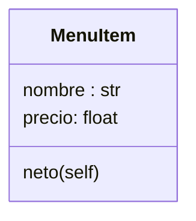
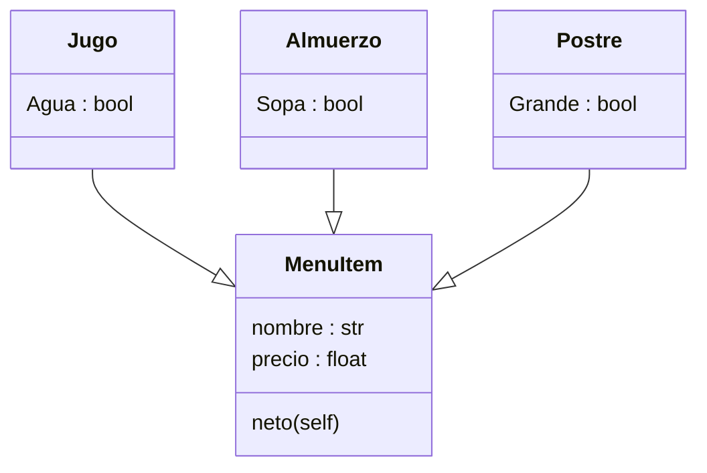
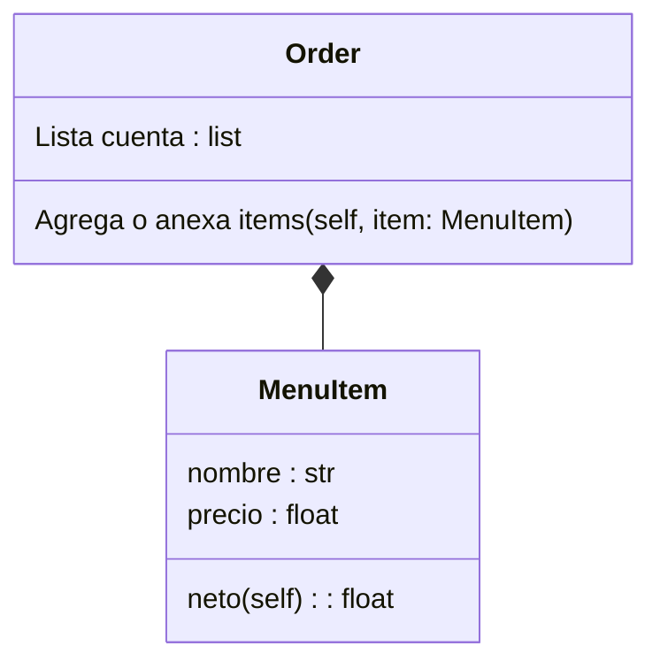

# Reto 3 Toro Juan Manuel.

En el reto 3 ponemos en practica el tema de herencias (utimo tema visto en clases), el cual usamos en un contexto de un restaurante tipo menu, con precios y nombres que daran como resultado
la cuenta total. 
¡veamos como fue el desarrollo de este proyecto!

## Clase MenuItem():

La clase **MenuItem** nos sirve como guia de lo que en las proximas clases se vera, por ejemplo, vemos que en todas aparecera tanto nombre como precio y devolvera al final el neto que sera el precio
final de cada clase.

```python
class MenuItem():
    def __init__(self, nombre :str, precio : float):  # clase principal, nombre y precio
        self.nombre = nombre                           
        self.precio = precio        


    def neto(self):                                  # funcion donde queda guardado el precio   
        return self.precio
```


## Herencia:
Ya tenemos el padre o en otras palabras la clase de la cual se guiara todo. esto nos sirve como una base (por asi decirlo) para el desarrollo de todo el sistema.
vamos a usar unas subclases llamadas **Almuerzo():, Jugo(): y Postre():** que seran las que heredaran los atributos y metodos de MenuItem, sin embargo, aunque toodas tengan 
"**nombre*" y "**precio*" cada una tiene algo unico y diferente que las caracteriza en cada caso(masomenos), que son atributos diferentes aunque con la misma estructura...lo mismo pero con otro nombre

Mejor dicho:

<ol>
  <li>Digamos en la Clase Almuerzo(): tiene un atributo extra, del cual es un booleano que a su vez en temas practicos es un "¿quiere su almuerzo con sopa o sin sopa?" </li>
  <li>En el caso de clase postre(): tiene un atributo el cual le pregunta si usted quiere un postre grande o uno pequeño(otro booleano).</li>
  <li>En la clase Jugo(): tiene un atributo diferente el cual nos pregunta si usted quiere el jugo en agua o en leche (otro booleano).</li>
</ol>

**En conclución:** 
Estamos dando dos tipos de clase, uno muy general y otro no tan general, del cual esta sera la que herede de la clase más general.

Ademas con los atributos extra los aproveche para que en cada clase diferente se descontara o incrementara su valor en pesos colombianos
de tal forma que sea simplemente pedir el jugo en leche y ver que aumeta 3 mil pesos más (y esta barato), solo como ejemplo.
```python
class  Almuerzo(MenuItem):
    def __init__(self, nombre : str, precio : float, sopa: bool): # mismos datos que el padre con la diferencia 
        super().__init__(nombre, precio)                          # de que este se le tiene sopa o no, haciendo
        if sopa == True:                                          # "descuento"si pide sin sopa
            self.sopa = "con sopa"
        else:
            self.sopa = "sin sopa"
            self.precio = self.precio -500

#   def mostrar(self):
#        return f"El cliente pidio {self.nombre,self.sopa}, eso cuesta: \n{self.precio} "
    

class Jugo(MenuItem):                                            
    def __init__(self, nombre: str, precio: float, agua:bool):   # mismos datos que el padre con la diferencia 
        super().__init__(nombre, precio)                         # de que si el jugo es con agua o en leche, 
        if agua == True:                                         # afectando en el precio
            self.agua = "Jugo en agua"
        else:
            self.agua = "Jugo en leche"
            self.precio = self.precio +1500
    
    
#    def mostrar(self):
#        return f"El cliente pidio {self.nombre,self.agua}, eso cuesta: \n{self.precio} "
    
        
class Postre(MenuItem):
    def __init__(self, nombre:str, precio: float, extra: bool):   # Mismos datos que en el padre con la diferencia
        super().__init__(nombre, precio)                           # de que tiene el dato de pedir mas grande o normal, 
        if extra == False:                                        # Alterando en el precio al final
            self.extra= "Postre normal"
        else:
            self.extra = "Postre Grande"
            self.precio = self.precio +2000


#    def mostrar(self):     # este solo lo uso como comprobacion mientras hago el codigo
#        return f"El cliente pidio {self.nombre,self.grande}, eso cuesta: \n{self.precio} "
        

```


## clase order():

Por ultimo usamos los datos anteriores para ordenarlos en una lista y luego usarlos para sumar y obtener el valor neto de todo la compra,
se divide en tres partes, la parte donde quedara almacenado, la parte donde se le añaden datos y 
la paarte donde se sumaran los datos por medio de un for.
```python
class Order:
    def __init__(self):                          #lista donde quedara toda la cuenta
        self.lista_cuenta = []
          
    def añadidura(self, item: "MenuItem"):       # adición de datos a la lista
        self.lista_cuenta.append(item)
    
    def cuenta(self):
        self.total = float(0)                     # suma de producto por producto hasta tener un total neto
        
        for item in self.lista_cuenta:
            self.total += item.neto()

        return self.total
```


## Como resutado TOTAL :

```python

class MenuItem():
    def __init__(self, nombre :str, precio : float):  # clase principal, nombre y precio
        self.nombre = nombre                           
        self.precio = precio        


    def neto(self):                                  # funcion donde queda guardado el precio   
        return self.precio


class  Almuerzo(MenuItem):
    def __init__(self, nombre : str, precio : float, sopa: bool): # mismos datos que el padre con la diferencia 
        super().__init__(nombre, precio)                          # de que este se le tiene sopa o no, haciendo
        if sopa == True:                                          # "descuento"si pide sin sopa
            self.sopa = "con sopa"
        else:
            self.sopa = "sin sopa"
            self.precio = self.precio -500

#    def mostrar(self):   
        return f"El cliente pidio {self.nombre,self.sopa}, eso cuesta: \n{self.precio} "
    

class Jugo(MenuItem):                                            
    def __init__(self, nombre: str, precio: float, agua:bool):   # mismos datos que el padre con la diferencia 
        super().__init__(nombre, precio)                         # de que si el jugo es con agua o en leche, 
        if agua == True:                                         # afectando en el precio
            self.agua = "Jugo en agua"
        else:
            self.agua = "Jugo en leche"
            self.precio = self.precio +1500
    
    
 #   def mostrar(self):
        return f"El cliente pidio {self.nombre,self.agua}, eso cuesta: \n{self.precio} "
    
        
class Postre(MenuItem):
    def __init__(self, nombre:str, precio: float, extra: bool):   # Mismos datos que en el padre con la diferencia
        super().__init__(nombre, precio)                           # de que tiene el dato de pedir mas grande o normal, 
        if extra == False:                                        # Alterando en el precio al final
            self.extra= "Postre normal"
        else:
            self.extra = "Postre Grande"
            self.precio = self.precio +2000


#    def mostrar(self):
        return f"El cliente pidio {self.nombre,self.grande}, eso cuesta: \n{self.precio} "
        

class Order:
    def __init__(self):                          #lista donde quedara toda la cuenta
        self.lista_cuenta = []
          
    def añadidura(self, item: "MenuItem"):
        self.lista_cuenta.append(item)
    
    def cuenta(self):
        self.total = float(0)                     # suma de producto por producto hasta tener un total neto
        
        for item in self.lista_cuenta:
            self.total += item.neto()

        return self.total

    
    def mostrar(self):
        return f"{self.lista_cuenta},con un total de { self.total}"   

#probamos el codigo
cliente = Order()                                             
cliente.añadidura(Jugo("maracuya", 5000, False))   
cliente.añadidura(Almuerzo("corriente", 12000, False))
cliente.añadidura(Postre("wafles", 2500, True))
cliente.añadidura(Jugo("fresa", 5000, True))   
cliente.añadidura(Almuerzo("pescado", 20000, False))
cliente.añadidura(Postre("fresas con crema", 3000, True))
cliente.añadidura(Jugo("mora", 5000, False))   
cliente.añadidura(Almuerzo("bandeja paisa", 25000, True))
cliente.añadidura(Postre("arequipe", 1000, True))
cliente.añadidura(Jugo("mango", 5000, True))   
cliente.añadidura(Almuerzo("corriente", 25000, True))
cliente.añadidura(Postre("brownie", 1000, True))

print(f"Valor Total a pagar: ${cliente.cuenta()} pesos")
```
# Palabras y datos curiosos:
La verdad no supe en que restaurante o bajo que condiciones se disminuye el valor, pues 
normalmente aunque sean 1 o 10 almuerzos no influye en el valor neto, por eso solo se me ocurrio si 
preferia en la comida una adición de cuenta, pensaba poner propina, pero me di cuenta que mi codigo solo 
aumenta y no disminuye...como en la vida, aunque aun así intente dar un toque diferente a solo poner porcentejes de resta.

Se me dificulto tomar todos los precios y sumarlos, pero un amigo mio me enseño como hacerlo por medio del for, la verdad bastante util, 
de resto como actividad, me gusto entender la parte de heredar, por lo menos me quedo más claro 
que composición (ja). y si alguien llega acá y lee todo esto... pueees fuerte desparche, ja no mentiras, hasta el proximo reto, bye. 


